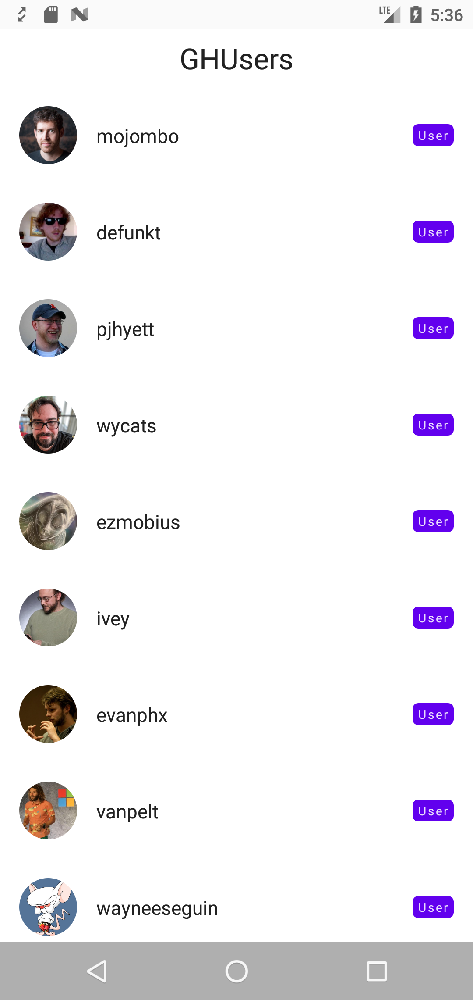

# GHUsers
A work-in-process app that fetch users from the Github API and show them in a list. 

  

## Development
 - Entirely written in [Kotlin](https://kotlinlang.org/).
 - UI is written with [Jetpack Compose](https://developer.android.com/jetpack/compose).
 - Use [Kotlin Coroutines](https://kotlinlang.org/docs/reference/coroutines/coroutines-guide.html).
- Use Navigation Component for navigation.
- Use  [Hilt](https://dagger.dev/hilt/)  for dependency injection.
- Use [Coil Compose](https://coil-kt.github.io/coil/compose/) for image loading.
- Use [ktlint](https://pinterest.github.io/ktlint/) for linting and formatting.
- Use [Kotlin Serialization](https://github.com/Kotlin/kotlinx.serialization) library.
- Use cache-control for caching.

## Features

 - [x] User list
 - [x] Details
 - [x] Show repositories on details screen
 - [ ] Show gists on details screen
 - [ ] Authentication
 - [ ] Follow/Unfollow someone

## Improvement Ideas
 - Add tests.
 - Add ability to search.
 - Use database to cache data instead of cache-control.
